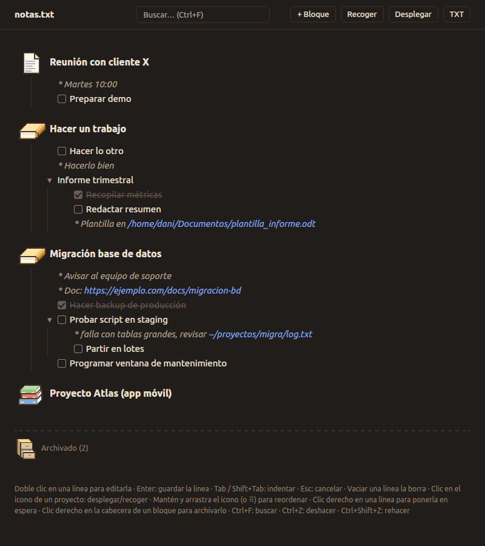

# Notas

Un gestor de notas minimalista para Ubuntu que trabaja directamente sobre un fichero **TXT**.



## Qué hace

- **Desplegar y recoger** cualquier bloque, solo ese nivel y no lo de dentro.
- **Marcar tareas** como hechas con una casilla.
- **Reordenar** con drag and drop entre elementos del mismo nivel. Solo cuenta la altura del ratón,
  no hay que apuntar con precisión.
- **Poner en espera** cualquier línea con clic derecho, cuando dependes de alguien: se marca con
  `[ EN ESPERA ]` en el TXT y se ve en amarillo grisáceo con un reloj de arena delante. Todo lo que
  tiene dentro también se tiñe, y si es un proyecto, su icono también.
- **Archivar** un proyecto con clic derecho en su cabecera. Se va al final del TXT, bajo la línea de separación.
- **Buscar** con Ctrl+F, sin distinguir mayúsculas ni tildes. Muestra las coincidencias con su contexto.
- **Deshacer y rehacer** cualquier cambio con Ctrl+Z y Ctrl+Shift+Z.
- **Editar** cualquier línea con doble clic, o el TXT entero en crudo con el botón *TXT*.
- **Guardado automático** con cada cambio. Si el TXT se modifica desde otro programa, la ventana
  se actualiza sola.
- **Copia de seguridad** al abrir: `<fichero>.bak`.
- Cada proyecto lleva un **icono pixel art** que crece con la cantidad de notas: una hoja, un par
  de notas, una carpeta llena, una pila de libros o un montón desbordado. Con un clic se despliega
  y arrastrándolo se mueve.

## Atajos

| Atajo | Acción |
|---|---|
| Doble clic | Editar una línea |
| Enter / Esc | Guardar / cancelar la edición |
| Tab / Shift+Tab | Indentar / desindentar la línea que editas |
| Vaciar una línea | Borrarla |
| Ctrl+F | Buscar (Esc para limpiar) |
| Ctrl+Z / Ctrl+Shift+Z (o Ctrl+Y) | Deshacer / rehacer |
| Ctrl+ / Ctrl− | Zoom |
| Ctrl+Q | Cerrar |

## Uso

```bash
./notas.py mis_notas.txt     # sin argumento, pregunta qué fichero abrir
```

No necesita instalar nada en Ubuntu de escritorio: usa Python 3, GTK y WebKit del sistema
(paquetes `python3-gi` y `gir1.2-webkit2-4.1`, o `gir1.2-webkit2-4.0` en distribuciones antiguas). Si se lanza con otro Python (conda, venv…),
el programa se relanza solo con el del sistema.

Al arrancar, `notas.py` crea (o corrige, si has movido la carpeta)
`~/.local/share/applications/notas.desktop`, así que basta con abrirlo una vez para que
aparezca en el menú de aplicaciones y en el dock con su icono.

## Ficheros

| Fichero | Contenido |
|---|---|
| `notas.py` | La ventana (GTK + WebKit) y la lectura y escritura del TXT |
| `ui.html` | La interfaz: árbol, edición, búsqueda, deshacer y los iconos pixel art |
| `icono.svg` | Icono de la aplicación |
| `ejemplo.txt` | Notas de ejemplo para probar |

Los iconos de los proyectos son cuadrículas de letras en `ui.html` (`SPRITES` y `PALETTE`),
fáciles de retocar. Los límites de cada nivel están en `PILE_LEVELS`.

## Créditos

Programado por **Claude** (Opus 5.5, de Anthropic) con Claude Code: el código, la interfaz y los
iconos, pixel a pixel.
